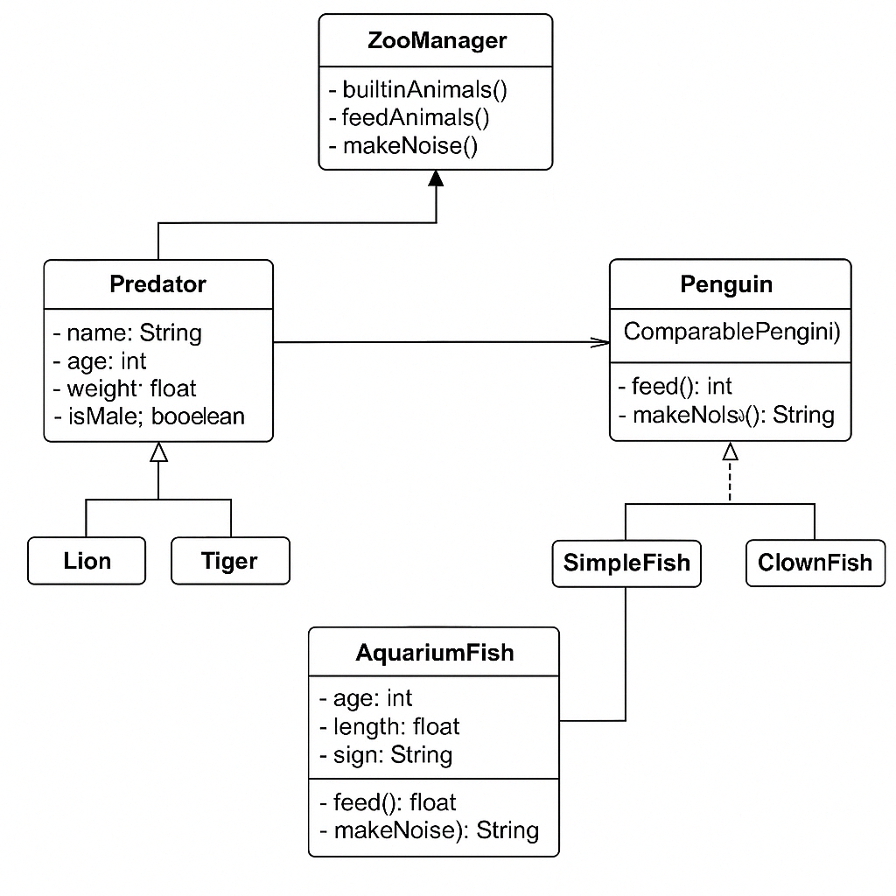

# 🦁 Zoo Management System - Java OOP + PostgreSQL

A Java-based application that demonstrates Object-Oriented Programming (OOP) concepts through the simulation and management of a zoo with integrated PostgreSQL database support via pgAdmin.

## 📚 Overview

This project allows you to:
- Add and manage different types of animals
- Sort animals by custom logic (e.g., name, age)
- Represent different species using inheritance and polymorphism
- Apply comparators and interfaces for sorting and filtering
- Use exception handling and encapsulation
- Perform persistent storage and queries with PostgreSQL
- Demonstrate team collaboration in a single Java project

## 🧠 Object-Oriented Design

- **Inheritance**:
  - `Predator` → `Lion`, `Tiger`
  - `AquariumFish` → `SimpleFish`, `ClownFish`, `GoldFish`
- **Composition**: `ZooManager` manages all animals (stored as `Object[]`)
- **Interface**: `Penguin` implements `Comparable<Penguin>`
                  PenguinNameComparator and PenguinAgeComparator used for sorting


## 🗃️ PostgreSQL Database Integration

The project supports a full integration with PostgreSQL, allowing persistent storage of all animals and zoo operations using JDBC and management via pgAdmin.

## 🧱 Tables Used

- Animal
- Penguin
- Predator → Lion, Tiger
- AquariumFish → SimpleFish, ClownFish, GoldFish

## 📥 Example Operations

- Insert animals into the database (insertLion(), insertClownFish() etc.)
- Display sorted data from DB (showPenguinFromDB(), showPredatorsFromDB())
- Feed animals to reset their happiness
- Age all animals by 1 year and remove those who exceed life span or reach zero happiness
- Reset entire zoo (resetZoo())

## 🧱 Project Structure

```
ZooManager.java           // Main control logic
Main.java                 // Entry point
AquariumFish.java         // Base class for fish
├── SimpleFish.java
├── ClownFish.java
├── GoldFish.java
Predator.java             // Base class for predators
├── Lion.java
├── Tiger.java
Penguin.java              // Implements Comparable
PenguinNameComparator.java
PenguinAgeComparator.java
Address.java
DBConnector.java          // Manages DB connection
DBManager.java            // Executes all DB operations
```

## 📷 Class Diagram



## 👨‍💻 Technologies

Java 17+
JDBC (Java Database Connectivity)
PostgreSQL
pgAdmin
IntelliJ
